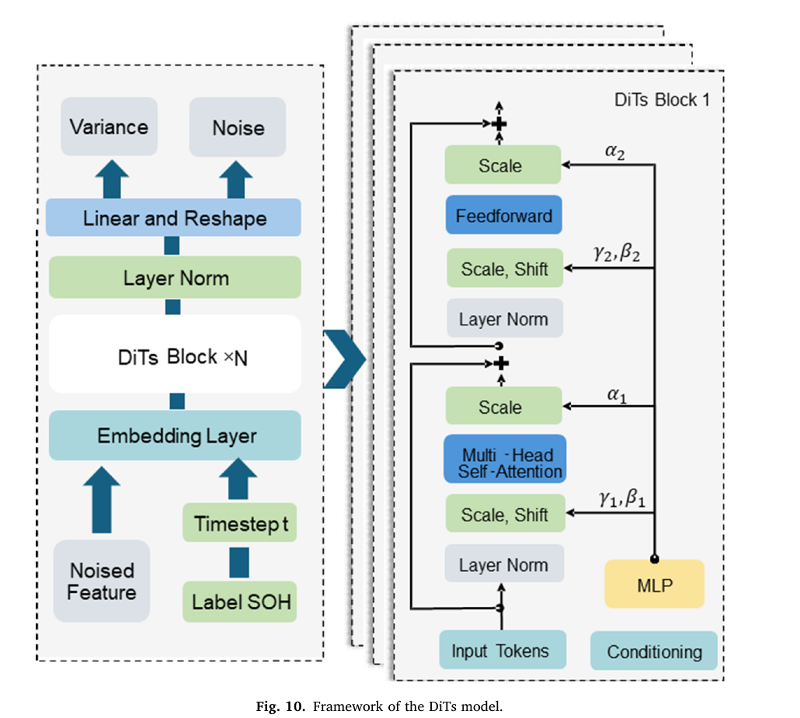

# SG-DiTs：面向可靠电池 RUL 预测的物理信息扩散 Transformer 混合框架

> Jing Sun, Jingfan Gao. *Journal of Energy Storage* 152 (2026) 120479. DOI: 10.1016/j.est.2026.120479  
> 本文档是为代码复现建立的重点段落中英对照读本；页码均指本地 PDF 页码。公式符号按原文保留，文字为忠实意译，不替代出版商排版版本。

## S001 摘要：总体框架（PDF p.1）

**Original:** The paper proposes SG-DiTs, a physics-informed framework that combines multidimensional health indicators with a diffusion transformer to improve battery remaining-useful-life prediction and uncertainty reliability.

**中文:** 论文提出 SG-DiTs：先从充电过程构建多维物理健康指标，再用扩散 Transformer 学习电池退化轨迹，以提高剩余寿命预测精度并给出可靠的不确定性表征。

## S002 物理信息的含义（PDF pp.3–5）

**Original:** The physics-informed component is formed by electrochemical and dynamical health indicators extracted from charging curves. These indicators provide interpretable degradation information to the data-driven diffusion model.

**中文:** 本文所谓“物理信息”是从充电曲线提取的电化学与动力学健康指标。这些可解释指标作为扩散模型的条件信息；原文没有另设物理方程残差 loss。

## S003 十二项健康特征（PDF pp.5–7）

**Original:** Eight indicators are obtained from incremental-capacity and differential-voltage curves: the number, position, height, and area of the principal peaks for dQ/dV and dV/dQ. Four further indicators are constant-voltage capacity, exponential current-decay time constant, Shannon entropy, and maximum Lyapunov exponent.

**中文:** 十二项特征包括：dQ/dV 与 dV/dQ 曲线各自的峰数量、主峰位置、主峰高度和积分面积，共八项；再加恒压阶段容量、恒压电流指数衰减时间常数、Shannon 熵和最大 Lyapunov 指数，共十二项。

## S004 正向扩散（PDF p.8）

**Original:** The forward process gradually corrupts a clean sample with Gaussian noise according to a prescribed variance schedule. The closed-form marginal allows an arbitrary diffusion step to be sampled directly from the clean input.

**中文:** 正向过程按照预设方差调度逐步向干净样本加入高斯噪声。利用闭式边缘分布，可以从干净输入直接采样任意扩散时刻的带噪状态，而不必逐步执行全部正向链。

## S005 反向去噪（PDF pp.8–9）

**Original:** A conditional neural network predicts the noise in the corrupted trajectory, enabling iterative reverse transitions from Gaussian noise toward a degradation trajectory conditioned on health information and SOH.

**中文:** 条件神经网络预测退化轨迹中加入的噪声，并由高斯噪声逐步执行反向转移，最终生成受健康特征与 SOH 条件约束的退化轨迹。

## S006 DiT 与 AdaLN（PDF pp.9–10）

**Original:** The noised feature sequence is patch-embedded and processed by DiT blocks. Timestep and SOH embeddings modulate adaptive layer normalization through scale, shift, and residual-gating parameters.

**中文:** 带噪特征序列先做 patch embedding，再进入 DiT block。扩散时刻嵌入和 SOH 条件嵌入共同产生 AdaLN 的缩放、平移及残差门控参数，从而在各 Transformer 层注入条件。

**Figure 10 / 图10：** 原文 SG-DiTs 结构。输入包括带噪特征、扩散时刻和 SOH 标签；DiT block 内含 AdaLN 调制、注意力与前馈层；输出头同时标示 Noise 和 Variance。代码保留双输出头，但原文仅明确给出噪声 RMSE 监督。

## S007 训练目标与噪声调度（PDF p.10）

**Original:** Training minimizes the root-mean-square error between sampled Gaussian noise and the network prediction. The diffusion process uses 1,000 steps with a linear beta schedule from 0.0001 to 0.02.

**中文:** 训练目标是采样高斯噪声与网络预测噪声之间的均方根误差。扩散步数为 1000，beta 采用从 0.0001 到 0.02 的线性调度。

## S008 滚动预测任务（PDF p.17）

**Original:** A historical window of 40 cycles is used for rolling autoregressive prediction of the subsequent capacity trajectory and RUL.

**中文:** 原文用 40 个历史周期作为窗口，滚动自回归预测后续容量退化轨迹和 RUL。本仓库复现为统一任务将窗口改为 16，并在每个窗口只生成下一周期容量。

## S009 公开超参数（PDF pp.17–18）

**Original:** The reported DiT configuration uses model dimension 256, 12 blocks, 8 attention heads, patch size 4, batch size 256, and learning rate 0.0001.

**中文:** 原文公开的 DiT 配置为：模型维度 256、12 个 block、8 个注意力头、patch size 4、batch size 256、学习率 0.0001。

## 术语表

| English | 中文 | 复现中的名称 |
|---|---|---|
| incremental capacity | 增量容量 | dQ/dV |
| differential voltage | 微分电压 | dV/dQ |
| state of health | 健康状态 | SOH |
| remaining useful life | 剩余使用寿命 | RUL |
| adaptive layer normalization | 自适应层归一化 | AdaLN |
| maximum Lyapunov exponent | 最大 Lyapunov 指数 | MLE |

